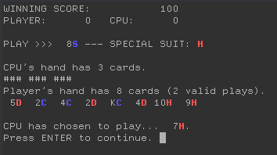
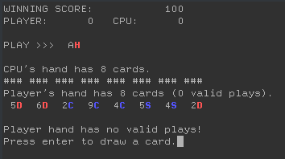
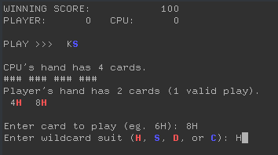
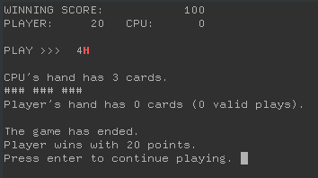

# 8f
Copyright 2020 Brian Puthuff

Redistribution and use in source and binary forms, with or without modification, are permitted provided that the following conditions are met:

Redistributions of source code must retain the above copyright notice, this list of conditions and the following disclaimer.

Redistributions in binary form must reproduce the above copyright notice, this list of conditions and the following disclaimer in the documentation and/or other materials provided with the distribution.

THIS SOFTWARE IS PROVIDED BY THE COPYRIGHT HOLDERS AND CONTRIBUTORS "AS IS" AND ANY EXPRESS OR IMPLIED WARRANTIES, INCLUDING, BUT NOT LIMITED TO, THE IMPLIED WARRANTIES OF MERCHANTABILITY AND FITNESS FOR A PARTICULAR PURPOSE ARE DISCLAIMED. IN NO EVENT SHALL THE COPYRIGHT HOLDER OR CONTRIBUTORS BE LIABLE FOR ANY DIRECT, INDIRECT, INCIDENTAL, SPECIAL, EXEMPLARY, OR CONSEQUENTIAL DAMAGES (INCLUDING, BUT NOT LIMITED TO, PROCUREMENT OF SUBSTITUTE GOODS OR SERVICES; LOSS OF USE, DATA, OR PROFITS; OR BUSINESS INTERRUPTION) HOWEVER CAUSED AND ON ANY THEORY OF LIABILITY, WHETHER IN CONTRACT, STRICT LIABILITY, OR TORT (INCLUDING NEGLIGENCE OR OTHERWISE) ARISING IN ANY WAY OUT OF THE USE OF THIS SOFTWARE, EVEN IF ADVISED OF THE POSSIBILITY OF SUCH DAMAGE.

## Description

8f is a single player implementation of the card game Crazy Eights. It is designed to run in the command line terminal, and utilizes ANSI color support for Linux/Unix and Mac.

The goal is set to 100 points. The player plays against the CPU until either has earned the goal.

## Compiling

8f is written in C. There is a makefile included in the repsitory to compile the executable.

## Playing 8f

When the game begins, each player is given a hand of 8 cards from a shuffled deck. A show card is presented and the human player must play off that card or draw from the deck until he is able to. During each turn, the game shows the valid number of cards that may be played in the user's hand.

The rules are simple. Each player must play a card from thier hand that either has the same value or the same suit. Suits can be changed by playing the same value from a different suit. A card with a value of 8 is a wild card and can be played regardless of the show card value and suit. When the 8 card is played, the player can choose a different suit than what is indicated on that card.

The first player to play out his entire hand wins, and his score is accumulated by the point values of the cards remaining the opposing player's hand. Ace is worth 1 point, and the value cards 2 - 10 (excluding 8) are worth their designated value. Court cards (J, Q, and K) are also worth 10 points each. Cards withthe value 8 are worth 50 points. The first player to earn 100 points wins the game.

